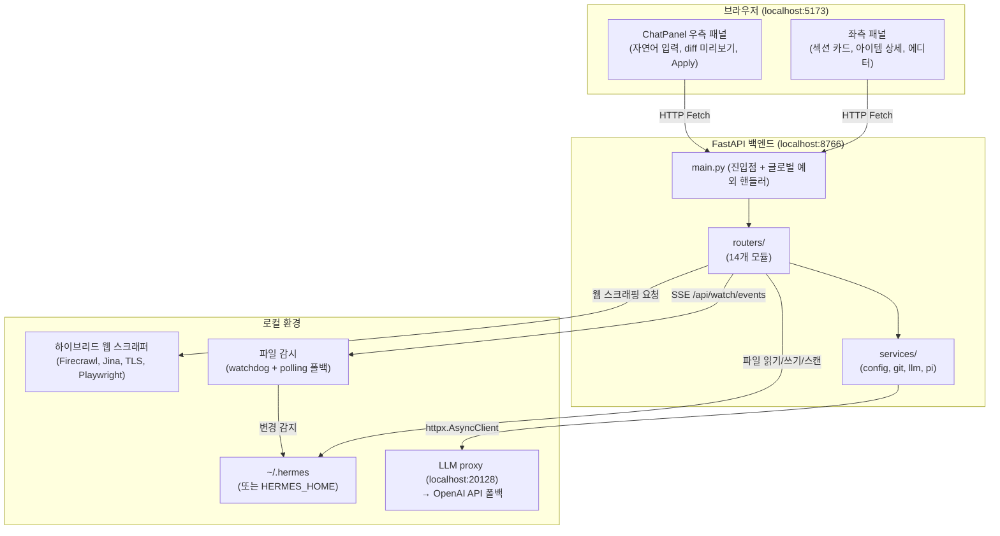

# Architecture — Agent Harness Studio

## 시스템 개요



---

## 백엔드 모듈 아키텍처 (2026-05-31 리팩토링)

```
src/server/
├── main.py                 # FastAPI 앱 + 4개 글로벌 예외 핸들러 + 14개 라우터 (86줄)
├── app.py                  # 하위 호환 리다이렉터: from .main import app
├── routers/                # 엔드포인트 정의 + HTTP 처리 (14개 파일, 2,462줄)
│   ├── scan.py             #   GET /api/scan, /api/scan/{section}, /api/workspaces
│   ├── mold.py             #   POST /api/mold (Chat Molder)
│   ├── pi.py               #   /api/pi/* (Agent Runner)
│   ├── git.py              #   /api/git/* (Git 연동)
│   ├── convert.py          #   /api/convert/* (Skill Converter)
│   ├── files.py            #   GET /api/read, POST /api/save, POST /api/rollback
│   ├── actions.py          #   POST /api/actions/archive, /api/actions/copy
│   ├── install.py          #   POST /api/install/skill (GitHub URL 정규화, dry_run)
│   ├── watch.py            #   GET /api/watch/events (SSE), GET /api/watch/status
│   ├── toggle.py           #   POST /api/toggle (MCP/hook enable/disable)
│   ├── sessions.py         #   GET /api/sessions/list, /api/sessions/messages
│   ├── env.py              #   GET /api/env
│   ├── web.py              #   POST /api/web/scrape
│   └── audit.py            #   GET /api/audit/logs
├── services/               # 비즈니스 로직 + 공유 유틸리티 (4개 파일, 770줄)
│   ├── config.py           #   HERMES_HOME, HARNESS_READONLY, 경로 검증, 백업
│   ├── git.py              #   git init/commit/log/checkout 래핑
│   ├── llm.py              #   LLM 클라이언트 (동기 OpenAI + 비동기 httpx)
│   └── pi.py               #   Pi CLI 실행/상태/환경 관리
├── usage_tracker.py        # Claude/Codex 사용량 파서
├── recommender.py          # Smart Diet 추천 엔진
└── scrapers/               # Hybrid Web Scraper 파이프라인
    ├── hybrid.py           #   4단계 오케스트레이터
    ├── firecrawl_scraper.py
    ├── jina_scraper.py
    ├── tls_scraper.py
    └── browser_scraper.py
```

### 임포트 규칙
- `main.py`가 `sys.path`에 `src/`와 `src/server/`를 추가
- 라우터/서비스는 **절대 임포트** 사용: `from services.config import ...`
- 교차 라우터 참조 허용: `mold.py` → `from routers.scan import build_response`

---

## 글로벌 에러 핸들링

`main.py`에 4개의 글로벌 예외 핸들러가 등록되어 있으며, 모든 에러는 일관된 JSON 포맷으로 응답합니다.

**응답 포맷:**
```json
{"detail": "에러 메시지", "error_type": "ValueError"}
```

| 핸들러 | HTTP 상태 | 대상 예외 |
|--------|-----------|-----------|
| `http_exception_handler` | 원래 상태 코드 유지 | `StarletteHTTPException` |
| `value_error_handler` | 422 | `ValueError` |
| `file_not_found_handler` | 404 | `FileNotFoundError` |
| `generic_exception_handler` | 500 | `Exception` (나머지 전부, 로깅 포함) |

개별 라우터의 try/catch 중복을 제거하고 비즈니스 로직에 집중할 수 있도록 설계되었습니다.

---

## 컴포넌트 상세

### 1. HermesScanner (`src/scanner/hermes_scanner.py`, 1,053줄)

`~/.hermes` 디렉토리를 순회하며 5종류의 하네스 컴포넌트를 탐지합니다.

**스캔 항목:**

| 타입 | 소스 | 탐지 방법 |
|------|------|-----------|
| `Skill` | `skills/**/SKILL.md` | rglob + YAML frontmatter 파싱 |
| `Memory Config` | `config.yaml` → `memory` 섹션 | yaml.safe_load |
| `Memory Manifest` | `memory_manifest.md` | 존재 여부 확인 |
| `Memory Directory` | `memory/` 디렉토리 | 파일 카운트 |
| `Memory State` | `state/` 디렉토리 | 파일 목록 |
| `MCP Server` | `config.yaml` → `mcp_servers` | transport 휴리스틱 탐지 |
| `Root Context` | `AGENTS.md`, `config.yaml` | 존재 여부 + 섹션 확인 |
| `Hook` | `hooks/` 디렉토리 | 파일명으로 hook_type 추론 |

**보안:**
- 민감 키 자동 마스킹: `SECRET`, `API_KEY`, `TOKEN`, `PASSWORD`, `KEY`, `CRED`, `AUTH` → `"REDACTED"`
- `mask_env_dict()` 로 MCP 서버 env 섹션 처리

**출력 스키마 (공통):**
```json
{
  "type": "Skill | MCP Server | Hook | ...",
  "name": "skill-name",
  "source_path": "/abs/path/to/file",
  "state": "ACTIVE | ERROR",
  "summary": "짧은 설명",
  "metadata": { ... }
}
```

---

### 2. FastAPI 백엔드

**진입점 (`src/server/main.py`, 86줄):**
```python
# sys.path에 src/와 src/server/ 추가
# 4개 글로벌 예외 핸들러 등록 (HTTP/Value/FileNotFound/Generic)
# 14개 라우터를 app.include_router()로 등록
# 모든 에러 → {"detail": "...", "error_type": "..."} 통일 포맷
```

**서비스 계층 (`src/server/services/`):**

| 서비스 | 주요 함수 | 역할 |
|--------|-----------|------|
| `config.py` | `resolve_hermes_path()`, `backup_file()`, `log_audit_event()` | 경로 검증, 백업, 감사 로그 |
| `git.py` | `git_commit_file()`, `is_git_repo()`, `capture_git_audit()` | git 연동 유틸리티 |
| `llm.py` | `get_llm_client()`, `call_llm_async()` | LLM 클라이언트 관리 |
| `pi.py` | `pi_status()`, `_run_pi_subprocess()`, `get_pi_runs()` | Pi Agent 실행 관리 |

**신규 라우터 상세:**

| 라우터 | 엔드포인트 | 역할 |
|--------|-----------|------|
| `toggle.py` | `POST /api/toggle` | config.yaml 내 MCP 서버/hook의 enable/disable 토글 |
| `watch.py` | `GET /api/watch/events` | SSE 기반 실시간 파일 감시 (watchdog 우선, polling 폴백) |
| `watch.py` | `GET /api/watch/status` | 현재 파일 감시 모드 상태 반환 (watchdog or polling) |
| `install.py` | `POST /api/install/skill` | URL에서 스킬 설치 (GitHub URL 정규화, dry_run 지원) |

**Chat Molder 프롬프트 구조 (`routers/mold.py`):**
```
system: MOLDER_SYSTEM_PROMPT (한국어 응답, JSON 전용)
user[0]: [{context_str}]\n\n{history[0].text}
assistant[0]: {history[0].response}
...
user[N]: [{context_str}]\n\n{current_prompt}
```
응답은 항상 JSON: `{"action": "CHAT|CREATE_SKILL|UPDATE_SKILL|...", "message": "...", ...}`

**LLM 클라이언트 (`services/llm.py`):**
- 동기: OpenAI SDK → `http://localhost:20128/v1`
- 비동기: `httpx.AsyncClient` POST → 스레드 블로킹 없이 동작
- 폴백: 로컬 프록시 실패 시 `OPENAI_API_KEY` 환경변수로 OpenAI API 호출

**`normalize_skill_content()` (`routers/mold.py`):**
LLM이 생성한 SKILL.md의 frontmatter 스키마 오류를 자동 수리:
- `hermese:` → `hermes:`
- frontmatter 없으면 기본 템플릿 래핑
- `metadata.hermes` 섹션 없으면 추가

---

### 3. React 프론트엔드 (`src/ui/src/`)

**App.jsx (2,775줄):** ChatPanel과 AgentRunnerPanel이 컴포넌트로 연동되어 있으며, 나머지 섹션 패널/설정 다이얼로그는 인라인으로 유지됩니다.

**상태 관리 (Zustand 스토어, 전체 액션 API 포함):**

| 스토어 | 파일 | 관리 상태 | 주요 액션 |
|--------|------|-----------|-----------|
| `useHarnessStore` | `stores/useHarnessStore.js` (99줄) | summary, items, selectedSection, envInfo, workspaces | `fetchScan()`, `selectSection()`, `setActiveWorkspace()` |
| `useEditorStore` | `stores/useEditorStore.js` (126줄) | editingItem, editContent, saveStatus, gitLog, showHistory | `openEditor()`, `save()`, `rollback()`, `fetchGitLog()`, `gitRollback()` |
| `useChatStore` | `stores/useChatStore.js` (154줄) | chatHistory, molderResponse, piMode, llmProvider | `sendMold()`, `sendMoldWithPi()`, `fetchLlmProvider()`, `saveLlmProvider()` |
| `useAgentRunnerStore` | `stores/useAgentRunnerStore.js` (88줄) | agentRunners, piRunId, piRunMeta, piRunLog | `fetchAgentRunners()`, `previewPiRun()`, `submitPiRun()`, `fetchPiRunLog()` |

**추출된 컴포넌트:**

| 컴포넌트 | 파일 | 역할 |
|----------|------|------|
| `EditorErrorBoundary` | `components/EditorErrorBoundary.jsx` (28줄) | 에디터 에러 방어막 |
| `MarkdownContent` | `components/MarkdownContent.jsx` (165줄) | 마크다운 렌더러 |
| `MolderMessage` | `components/MolderMessage.jsx` (67줄) | 채팅 메시지 버블 |
| `ChatPanel` | `components/ChatPanel.jsx` (415줄) | Chat Molder 패널 |
| `AgentRunnerPanel` | `components/AgentRunnerPanel.jsx` (250줄) | Pi Agent 실행 패널 |

**레이아웃:**
```
app-layout (flex-row)
├── sidebar-container (좌측)
│   ├── app-header (브랜드 + env 배지)
│   ├── harness-overview (7개 섹션 카드)
│   └── content-area
│       ├── detail-panel (섹션 선택 시)
│       │   └── item-row (아이템 목록)
│       └── editor-panel (Edit 클릭 시)
│           ├── panel-header (Save/Rollback/Cancel)
│           └── textarea (code-editor)
└── chat-container (우측)
    ├── chat-messages (대화 히스토리)
    │   └── chat-bubble (user/assistant)
    │       └── chat-proposal (diff + Apply 버튼)
    └── chat-footer (입력창 + Send)
```

**데이터 흐름 (편집):**
```
handleEditClick(item)
  → fetch GET /api/read?path={item.source_path}
  → setEditContent(data.content)
  → 사용자 편집
  → handleSave()
    → fetch POST /api/save {path, content}
    → 서버: backup_file() + write_text()
    → setLastBackup(data.backup)
    → (선택) handleRollback()
      → fetch POST /api/rollback {path}
      → 서버: 최신 .bak.* 복원 + 삭제
```

---

### 4. 실시간 파일 감시 (`src/server/routers/watch.py`)

`HERMES_HOME` 디렉토리의 파일 변경을 감지하여 SSE(Server-Sent Events)로 클라이언트에 푸시합니다.

**감시 모드:**

| 모드 | 조건 | 동작 |
|------|------|------|
| watchdog | `watchdog` 패키지 설치됨 | `Observer`로 파일 시스템 이벤트 실시간 수신 |
| polling | watchdog 미설치 | 3초 간격으로 디렉토리 스캔, 변경 감지 |

**엔드포인트:**
- `GET /api/watch/events` — SSE 스트림. 이벤트 타입: `scan_change`, `watch_status`
- `GET /api/watch/status` — JSON. 현재 감시 모드(`watchdog` or `polling`) 반환

---

### 5. 스킬 설치 (`src/server/routers/install.py`)

GitHub URL 등 외부 소스에서 스킬을 설치합니다.

**`POST /api/install/skill` 기능:**
- GitHub URL 정규화: `https://github.com/user/repo` → raw content URL 변환
- `dry_run` 모드 지원: 실제 설치 없이 설치 내역 미리보기
- `HARNESS_READONLY=1` 시 403 차단
- 설치 전 대상 경로 검증 (경로 traversal 방지)

---

### 6. Hybrid Web Scraper (`src/server/scrapers/`)

4단계 폴백 파이프라인:

```
Phase 1: Firecrawl API
  → firecrawl-py SDK, FIRECRAWL_API_KEY 필요
  → 성공 시 마크다운 반환

Phase 2: Jina Reader API
  → https://r.jina.ai/{url} GET 요청
  → 무료, 속도 제한 있음

Phase 3: TLS Fingerprint (curl_cffi)
  → 브라우저 TLS 지문 스푸핑으로 Bot 차단 우회
  → markdownify로 HTML → MD 변환

Phase 4: Playwright 브라우저 자동화
  → headless Chromium
  → JavaScript 렌더링 필요한 SPA 대응
  → playwright install chromium 선행 필요
```

성공한 Phase 정보는 `response.phase_used`로 반환.

---

## 테스트 아키텍처 (`tests/`, 66개 테스트)

```
tests/
├── conftest.py                 # ASGI Transport + HARNESS_READONLY=1 fixture
├── pytest.ini                  # asyncio_mode = auto
├── api/
│   ├── test_endpoints.py       # 18개 API 엔드포인트 테스트
│   └── test_routers.py         # 26개 라우터 통합 테스트 (toggle, watch, install 등)
├── test_scanner.py             # 10개 스캐너 테스트
├── test_services.py            # 3개 서비스 테스트
└── test_install.py             # 9개 스킬 설치 테스트
```

| 테스트 파일 | 테스트 수 | 커버 범위 |
|-------------|-----------|-----------|
| `test_endpoints.py` | 18 | health, workspaces, env, scan, audit, LLM provider, readonly, 파일 읽기, git log |
| `test_routers.py` | 26 | toggle, watch, install, convert, files, git, mold, pi, scan, sessions, actions |
| `test_scanner.py` | 10 | 인스턴스 생성, scan_all, skills, MCP, hooks, memory, root_context, plugins, cron |
| `test_services.py` | 3 | allowed_roots, is_git_repo, is_not_git_repo |
| `test_install.py` | 9 | GitHub URL 정규화, 설치 워크플로우, 에러 케이스 |

테스트는 `httpx.AsyncClient` + `ASGITransport`로 실제 서버 실행 없이 FastAPI 앱을 직접 테스트합니다.
`HARNESS_READONLY=1`을 설정하여 테스트 중 실제 파일 쓰기를 방지합니다.

---

## CI 파이프라인

`.github/workflows/ci.yml` — 병렬 백엔드/프론트엔드 jobs:

```yaml
jobs:
  test-backend:        # Python 3.13 + pip install + pytest
  build-frontend:      # Node.js 20 + npm ci + vite build
```

- 트리거: `push`/`pull_request` to `main`
- 두 job은 독립적으로 병렬 실행

---

## 환경 변수 전체 목록

| 변수 | 기본값 | 사용처 |
|------|--------|--------|
| `HERMES_HOME` | `~/.hermes` | 스캔 대상 디렉토리 (`services/config.py`) |
| `HARNESS_READONLY` | `0` | `1`이면 모든 쓰기 차단 (`services/config.py`) |
| `FIRECRAWL_API_KEY` | (없음) | Firecrawl Phase 1 활성화 |
| `OPENAI_API_KEY` | (없음) | LLM proxy 대체 (`services/llm.py`) |

---

## 의존성

```
fastapi>=0.111.0          # HTTP 프레임워크
uvicorn[standard]>=0.30.0 # ASGI 서버
PyYAML>=6.0.0             # config.yaml 파싱
openai>=1.0.0             # LLM 클라이언트 (LLM proxy 호환)
firecrawl-py>=1.0.0       # Phase 1 스크래퍼
python-dotenv>=1.0.0      # .env 로드
httpx>=0.27.0             # async HTTP (LLM 비동기 호출 + Jina 스크래퍼)
curl_cffi>=0.7.0          # Phase 3 TLS 스크래퍼
playwright>=1.44.0        # Phase 4 브라우저 스크래퍼
markdownify>=0.12.0       # HTML → Markdown 변환
watchdog>=4.0.0           # 실시간 파일 감시 (선택적, 미설치 시 polling 폴백)
pytest>=8.0.0             # 테스트 프레임워크
pytest-asyncio>=0.24.0    # 비동기 테스트 지원
```
