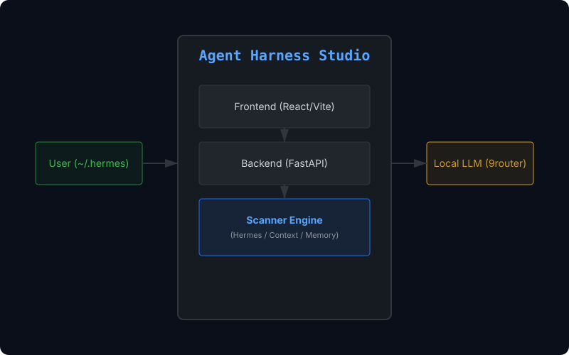

# Agent Harness Studio

An open-source local web dashboard to **visualize, manage, and modify** your AI agent's harness configuration — skills, memory, MCP servers, hooks, cron jobs, plugins, and root context — all through a conversational AI interface.

## Core Philosophy: Harness over Model

The design of an agent's **harness** — its skills, memory, tools, and behavioral context — has a greater impact on practical productivity than raw model performance. Agent Harness Studio empowers builders to systematically refine this environment.



### Demo Video

See the studio in action: [Intro Video](docs/assets/agent-harness-studio-intro.mp4)

---

## Features

### Harness Scanner
Scans your `~/.hermes` directory and discovers all harness components:
- **Skills** — `skills/**/SKILL.md` with YAML frontmatter, external dirs, disabled state
- **Skill Bundles** — `skill-bundles/*.yaml` workflow packs
- **MCP Servers** — `config.yaml` mcp_servers (stdio + HTTP, with transport/auth/tools metadata)
- **Hooks** — Shell hooks, gateway hooks (`hooks/<name>/HOOK.yaml`), legacy hook files
- **Memory** — Config, manifest, memories directory, state files
- **Cron Jobs** — `cron/jobs.json` with status tracking
- **Plugins** — `plugins/*/plugin.yaml` with tools/hooks counts
- **Root Context** — AGENTS.md, SOUL.md, system_prompt

### Section Dashboard
11 section cards providing a bird's-eye view of your entire harness:
Skills, Skill Bundles, MCP, Hooks, Memory Map, Cron, Plugins, Context, Config, Audit Log, Web Context.

### 2-Column App Layout
- **Left panel** (55%): Section cards + category detail + file editor
- **Right panel** (45%): Chat Molder conversational AI

### Chat Molder — Conversational AI Assistant
A built-in AI chat that answers questions AND creates/modifies harness items:
- **CHAT mode**: Answers questions about your harness configuration (Korean language)
- **CREATE/UPDATE mode**: Generates SKILL.md files with proper YAML frontmatter
- **Server-side schema validation**: `normalize_skill_content()` auto-repairs frontmatter errors
- **Multi-turn conversation**: Maintains chat history for context-aware responses
- **Context-aware**: Knows which section/item you have selected in the dashboard
- **Hermes-reference grounded**: Every LLM call includes canonical `nousresearch/hermes-agent` context

### Hybrid Web Scraper
4-phase fallback pipeline for extracting web content as Markdown:
1. **Firecrawl API** (if `FIRECRAWL_API_KEY` available)
2. **Jina Reader API** (free, rate-limited)
3. **TLS Impersonation** (`curl_cffi` — bypasses Cloudflare/bot detection)
4. **Browser Automation** (Playwright headless Chromium for JS-heavy pages)

### File Editing
Click **Edit** on any item to load its real file content, modify, and save. Supports all text file types: `.md`, `.yaml`, `.yml`, `.json`, `.txt`, `.py`, `.sh`.

### Auto Backup
Every save automatically creates a `.bak.{timestamp}` sidecar file before overwriting.

### Rollback API
Restore from the most recent `.bak.*` backup with one click.

### Git Integration
- **Auto-commit on save**: Every file save creates a git commit (custom message supported)
- **Full history panel**: View commit history per file with hash, message, date, author
- **Per-file rollback**: Restore any file to any previous commit state
- **Auto `.gitignore`**: Backup files, `.env`, logs, and DB files are excluded

### Safety Model (4 Layers)

| Layer | Protection | Reversible |
|-------|-----------|------------|
| `HARNESS_READONLY=1` | All write APIs return 403 | N/A |
| `HERMES_HOME=~/.hermes/sandbox` | Physically isolated from real data | No |
| Auto Backup (`.bak.*`) | Last-state snapshot before every save | Yes |
| Git Version Control | Full commit history, any-point rollback | Yes |

### Additional Features
- **Memory Map**: Unified view of all memory configuration surfaces
- **SOUL.md Editor**: Persona editing with 3 built-in presets (Developer, Researcher, Writer)
- **Context Window Estimator**: Token counting per harness item with a 128K budget display
- **Cross-Agent Skill Converter**: Convert skills between Hermes and Claude Code formats
- **SQLite Audit Log**: Changelog tracking for all save/rollback/init operations
- **Markdown Rendering in Chat**: Proper headings, lists, tables, and inline formatting in Chat Molder
- **LaunchAgent**: macOS auto-start via `launchctl` with KeepAlive + health monitoring

---

## Tech Stack

| Component | Technology | Port |
|-----------|-----------|------|
| Backend | FastAPI (Python 3.13+) + uvicorn | 8766 |
| Frontend | React + Vite | 5173 |
| Scanner | Custom HermesScanner | — |
| LLM | 9router local proxy (`model: letitbe`) → OpenAI API fallback | 20128 |
| Data Source | `~/.hermes` directory | — |

---

## Architecture

```
┌─────────────────────────────────────────────────────────────────┐
│                        Browser (localhost:5173)                  │
│  ┌──────────────────────┐    ┌──────────────────────────────┐   │
│  │   Left Panel          │    │    Chat Molder (Right)        │   │
│  │  - Section cards      │    │  - Natural language input     │   │
│  │  - Item detail list   │    │  - Diff preview               │   │
│  │  - File editor        │    │  - Apply / Rollback           │   │
│  └──────────┬───────────┘    └───────────────┬──────────────┘   │
└─────────────┼───────────────────────────────┼──────────────────┘
              │  HTTP (fetch)                  │  HTTP (fetch)
              ▼                                ▼
┌─────────────────────────────────────────────────────────────────┐
│                    FastAPI Backend (localhost:8766)               │
│                                                                 │
│  GET  /api/scan          → HermesScanner.scan_all()            │
│  GET  /api/scan/{section}→ HermesScanner + type filter         │
│  GET  /api/read          → Path.read_text()                    │
│  POST /api/save          → backup + write + git commit         │
│  POST /api/rollback      → .bak.* restore                      │
│  POST /api/mold          → OpenAI SDK → 9router/OpenAI         │
│  POST /api/web/scrape    → HybridScraper (4-phase)             │
│  GET  /api/env           → HERMES_HOME, sandbox, readonly, git │
│  POST /api/git/init      → git init + initial commit           │
│  GET  /api/git/log       → commit history                      │
│  GET  /api/git/diff      → per-commit diff                     │
│  POST /api/git/rollback  → per-file git restore                │
│  GET  /api/audit/logs    → SQLite audit trail                  │
│  POST /api/convert/skill → Hermes ↔ Claude Code conversion     │
└──────────┬──────────────────────────────────────┬──────────────┘
           │                                      │
           ▼                                      ▼
┌──────────────────────┐            ┌─────────────────────────────┐
│   ~/.hermes           │            │  9router (localhost:20128)   │
│   (or $HERMES_HOME)  │            │  - Local LLM proxy           │
│                      │            │  - Model: "letitbe"          │
│  skills/             │            │  - OpenAI API compatible     │
│  skill-bundles/      │            └─────────────────────────────┘
│  memory/             │
│  hooks/              │            ┌─────────────────────────────┐
│  cron/               │            │  Web Scraper Pipeline        │
│  plugins/            │            │  Phase 1: Firecrawl API      │
│  config.yaml         │            │  Phase 2: Jina Reader API    │
│  AGENTS.md           │            │  Phase 3: TLS (curl_cffi)    │
│  SOUL.md             │            │  Phase 4: Playwright Browser │
└──────────────────────┘            └─────────────────────────────┘
```

---

## Quick Start

### Prerequisites
- Python 3.13+
- Node.js & npm
- (Optional) 9router local proxy on port 20128, or an `OPENAI_API_KEY`

### Installation

```bash
# 1. Clone the repository
git clone https://github.com/misolove/agent-harness-studio.git
cd agent-harness-studio

# 2. Create virtual environment and install dependencies
python -m venv .venv && source .venv/bin/activate
pip install -r requirements.txt

# 3. Install frontend dependencies
cd src/ui && npm install && cd ../..

# 4. (Optional) Install Playwright browser for web scraping
playwright install chromium
```

### Running

```bash
# Start both backend and frontend
./run.sh

# Open in browser
open http://localhost:5173
```

### Sandbox Mode

```bash
# Isolated sandbox — safe for experimentation
HERMES_HOME=~/.hermes/sandbox ./run.sh

# Read-only mode — browse only, no writes
HARNESS_READONLY=1 ./run.sh

# Production mode — real data with git version control
HERMES_HOME=~/.hermes ./run.sh
```

### Development

```bash
# Backend only (with hot reload)
source .venv/bin/activate
HERMES_HOME=~/.hermes/sandbox python -m uvicorn src.server.app:app --port 8766 --reload

# Frontend only (separate terminal)
cd src/ui && npx vite
```

---

## Environment Variables

| Variable | Default | Description |
|----------|---------|-------------|
| `HERMES_HOME` | `~/.hermes` | Harness directory to scan. Set to `~/.hermes/sandbox` for isolation |
| `HARNESS_READONLY` | `0` | Set to `1` to block all write APIs |
| `OPENAI_API_KEY` | (none) | Fallback LLM when 9router is unavailable |
| `FIRECRAWL_API_KEY` | (none) | Enables Firecrawl as Phase 1 web scraper |

---

## API Overview

### Core Endpoints

| Method | Endpoint | Description |
|--------|----------|-------------|
| `GET` | `/health` | Health check |
| `GET` | `/api/env` | Environment info (home, sandbox, readonly, git status) |
| `GET` | `/api/scan` | Full harness scan with summary counts |
| `GET` | `/api/scan/{section}` | Section-filtered scan (skills, mcp, hooks, etc.) |
| `GET` | `/api/read?path=...` | Read file content (within HERMES_HOME only) |
| `POST` | `/api/save` | Save file with auto-backup and optional git commit |
| `POST` | `/api/rollback` | Restore from latest `.bak.*` backup |
| `GET` | `/api/reference/hermes` | Canonical Hermes reference context |

### Chat Molder

| Method | Endpoint | Description |
|--------|----------|-------------|
| `POST` | `/api/mold` | Conversational AI — CHAT, CREATE_SKILL, UPDATE_SKILL, SUGGESTION modes |

### Git Integration

| Method | Endpoint | Description |
|--------|----------|-------------|
| `POST` | `/api/git/init` | Initialize git repo in HERMES_HOME |
| `GET` | `/api/git/log?path=...&limit=...` | Commit history (optional file filter) |
| `GET` | `/api/git/diff?commit_hash=...` | Diff for a specific commit |
| `POST` | `/api/git/rollback` | Restore file to a specific commit state |

### Additional

| Method | Endpoint | Description |
|--------|----------|-------------|
| `POST` | `/api/web/scrape` | Hybrid 4-phase web content extraction |
| `GET` | `/api/audit/logs` | SQLite audit trail |
| `POST` | `/api/convert/skill` | Convert skills between Hermes ↔ Claude Code formats |

> Full API documentation: [docs/api.md](docs/api.md)

---

## Project Structure

```
agent-harness-studio/
├── src/
│   ├── scanner/
│   │   └── hermes_scanner.py        # Core: ~/.hermes scan engine
│   ├── server/
│   │   ├── app.py                   # FastAPI main app (all endpoints)
│   │   └── scrapers/                # Hybrid Web Scraper pipeline
│   │       ├── hybrid.py            # 4-phase orchestrator
│   │       ├── firecrawl_scraper.py
│   │       ├── jina_scraper.py
│   │       ├── tls_scraper.py
│   │       └── browser_scraper.py
│   └── ui/
│       └── src/
│           ├── App.jsx              # Main React component
│           ├── App.css              # Styling (dark theme)
│           └── ScrapingPipeline.jsx # Web scraping results display
├── docs/
│   ├── api.md                       # API reference
│   ├── prd.md                       # Product requirements
│   ├── git-safety.md                # Git safety guide
│   ├── firecrawl-vs-insane-search.md # Scraper comparison
│   └── assets/
│       ├── architecture.svg
│       └── agent-harness-studio-intro.mp4
├── AGENTS.md                        # Agent handoff document
├── ARCHITECTURE.md                  # Technical architecture
├── HANDOFF.md                       # Handoff notes
├── README.md                        # Korean README
├── requirements.txt                 # Python dependencies
└── run.sh                           # Launch script (backend + frontend)
```

---

## Dependencies

```
fastapi>=0.111.0        # HTTP framework
uvicorn[standard]>=0.30.0  # ASGI server
PyYAML>=6.0.0           # YAML parsing
openai>=1.0.0           # LLM client (9router/OpenAI compatible)
firecrawl-py>=1.0.0     # Phase 1 web scraper
python-dotenv>=1.0.0    # .env loading
httpx>=0.27.0           # Async HTTP (Jina scraper)
curl_cffi>=0.7.0        # Phase 3 TLS scraper
playwright>=1.44.0      # Phase 4 browser scraper
markdownify>=0.12.0     # HTML → Markdown conversion
```

---

## LLM Configuration

Chat Molder uses a local LLM proxy by default, with automatic fallback:

1. **Primary**: 9router at `http://127.0.0.1:20128/v1` (model: `letitbe`)
2. **Fallback**: OpenAI API (model: `gpt-4o`) if `OPENAI_API_KEY` is set
3. **Config override**: `~/.hermes/config.yaml` can specify custom `base_url`

Every LLM call includes canonical Hermes Agent reference context, so the model always understands the correct harness schema regardless of which LLM backend is used.

```bash
# .env (project root) — optional
OPENAI_API_KEY=sk-...
```

---

## Known Limitations

- **9router dependency**: Chat Molder requires 9router or an OpenAI API key. Without either, the `/api/mold` endpoint returns 500.
- **Single-user**: No authentication. Intended for localhost use only.
- **Large skill directories**: Scanning >100 skills may be slow (synchronous processing).
- **Browser scraper**: Requires `playwright install chromium` for Phase 4.
- **No real-time file watching**: Changes require manual refresh.

---

## Screenshots

> Screenshots coming soon. The UI features a dark-themed two-column layout with a section dashboard on the left and the Chat Molder on the right.

---

## Contributing

Contributions are welcome! Areas of interest:

- Multi-agent support (Claude Code, Codex, etc.)
- Real-time file watching via WebSocket/SSE
- Hook/MCP enable/disable toggle UI
- Harness Preset Gallery
- Diff side-by-side preview

Please open an issue first to discuss what you'd like to change.

---

## Documentation

| Document | Description |
|----------|-------------|
| [AGENTS.md](AGENTS.md) | Agent handoff — current state, known issues, extension points |
| [ARCHITECTURE.md](ARCHITECTURE.md) | System architecture, data flow, component details |
| [HANDOFF.md](HANDOFF.md) | Development handoff notes |
| [docs/api.md](docs/api.md) | Complete API endpoint reference |
| [docs/prd.md](docs/prd.md) | Product Requirements Document |
| [docs/git-safety.md](docs/git-safety.md) | Git integration safety guide |
| [docs/1pager.md](docs/1pager.md) | Project background and goals |
| [docs/wireframe.md](docs/wireframe.md) | UI/UX concept proposals |

---

## License

MIT © [letitbe](https://github.com/misolove)
